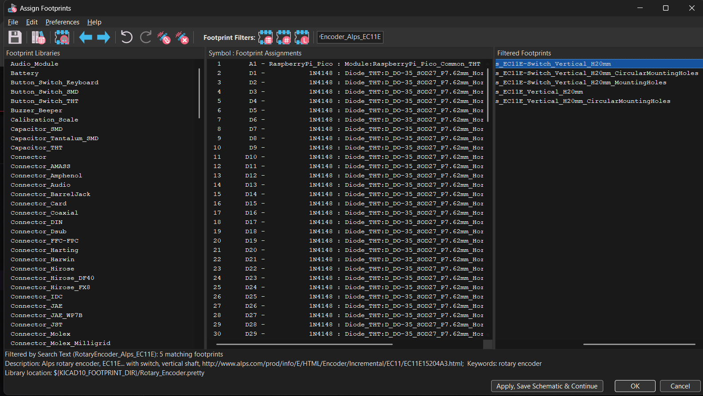

# Keeboard
my custom 65% mechanical keyboard

## Journal
### August 2 
(1 hour)
Planned out my 65% keyboard using excalidraw. Decided to add a rotary encoder in the top left for volume, due to the lack of a function row. The Raspberry Pi Pico is located in the top right to allow for USB-C port on top right corner. 

(1 hour) Set up KiCad and installed [marbastlib](https://github.com/ebastler/marbastlib) library. Also created the below matrix for my keyboard to plan where my rows and columns will go, and where each switch will connect to. I ended up with a 16x5 matrix grid, which uses 21 pins and handles 80 keys of which my keyboard uses 70 of. 

(1.5 hours) Designed schematic on KiCad, following my layout in the diagram above. Added the Pico, switches, diodes, stabilizers, and rotary encoder. Arranged each switch-diode set into a matrix following the layout of the matrix above. Then connected each row/column wire to the Pico using net labels. Also connected the Rotary Encoder to the Picousing net labels and GND symbols. Finally, annotated everything using the automatic annotation tool. Also checked that the connections were working with the highlight net label function and confirmed that everything was properly connected.

