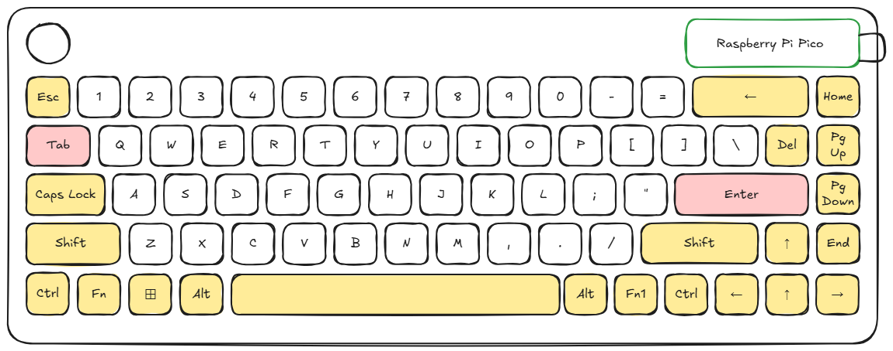

## Journal
### August 2 
(1 hour)
Planned out my 65% keyboard using excalidraw. Decided to add a rotary encoder in the top left for volume, due to the lack of a function row. The Raspberry Pi Pico is located in the top right to allow for USB-C port on top right corner. 

(1 hour) Set up KiCad and installed [marbastlib](https://github.com/ebastler/marbastlib) library. Also created the below matrix for my keyboard to plan where my rows and columns will go, and where each switch will connect to. I ended up with a 16x5 matrix grid, which uses 21 pins and handles 80 keys of which my keyboard uses 70 of. 

(1.5 hours) Designed schematic on KiCad, following my layout in the diagram above. Added the Pico, switches, diodes, stabilizers, and rotary encoder. Arranged each switch-diode set into a matrix following the layout of the matrix above. Then connected each row/column wire to the Pico using net labels. Also connected the Rotary Encoder to the Picousing net labels and GND symbols. Finally, annotated everything using the automatic annotation tool. Also checked that the connections were working with the highlight net label function and confirmed that everything was properly connected.

(0.5 hours) Assigned footprints to my components. Took a while because I had to find out what kind of footprint the rotary encoder uses, which I learned was a RotaryEncoder_Alps_EC11E-Switch_Vertical_H20mm footprint in KiCad. Also had to configure each stabilizer footprint to the correct size, but there were some that were a little smaller: 2.25u instead of my 2.5u so I will see how that works out later. 

(1.5 hours) Started to do the PCB from the schematic. Very very difficult, had to restart several times. I can't seem to get the grid working because of the nonortholinear layout, it doesn't cooperate very well, and I have to manually set every single switch. Anyways, I just finished debugging some minor math error, and I reconfigured the layout becasue 2.5u stabilizers aren't allowed apparently, so I just made the whole keyboard 0.25u wider. Then, I moved everything and readjusted the whole keyboard so now I have finished the top two rows of the keyboard, but only the switches. Hopefully, progress will ramp up soon, because this is getting very tedious.

(1.25 hours) Finished up the rest of the keyboard switches, and had to make further resizing changes and just lots of adding and subtracting to get the proper locations of each of the switches. Maybe I should've done an ortholinear keyboard instead, haha. Anyways, now it is configured with an additional 0.25u in width as there are no 2.5u stabilizers in the library. So there are some keys with like an extra 0.25u like the right control button, enter key etc..Anyways, this pcb assembly really tested my patience and was much more difficult than I thought it would be. The initial setup was pretty overwhelmed with all the lines connected everywhere but I think I'm slowly getting the hang of it. 

### Aug 3 
(1.25 hours) Woke up bright and early to continue working on this project! I have finished the diode placements, placing each diode on the right edge of the switch, roughly in the middle. I had to fix some rerouting errors leftover from the schematic because the schematic annotation was wrong and that led to the diode naming to be wrong, so I had to fix that up before placing the diodes. Then, I placed the stabilizers on the exact position as the switches. I also placed the rotary encoder in the top left, as I had planned in the original layout. Then, I also resized the PCB edge so that it would fit everything I had placed into it. Overall, it is now looking pretty clean and I am very happy with how it looks, as I move onto the next steps. 

(1 hour) Started doing the route tracing, and finished the front copper side. A lot more difficult than I imagined, because my original Pico connections were not very optimized for this, but after rearranging everything I figured out a way to get them placed neatly. Still only finished the front side, as I had to restart once realizing midway through that it wouldn't work, but now I think it is ok. My front copper currently has the rotary encoder connections and the row connections. And I plan on placing the column routes on the back side of the PCB. 

(1 hour) Finished all the front and back route tracing, with the rotary encoder as well. Started to become pretty intuitive and I started to understand more of how it was connecting back to the schematic. While finishing all the route tracing I also had to rewire some pins and change the board size and Pico positioning to accomodate all the routes, but luckily I managed to get it working. After that, I filled in the front and back copper with ground fill, and now I am at "Unrouted: 0"! Hopefully this means that I am almost done. 

Completed route traces screenshot:

Completed route traces + ground fill:

(0.75 hours) Shifted the Pico up a little bit to allow more clearance from the keyset. Completed the DRC testing and fixed everything that needs fixing. Also tested with the 3d model but I was too lazy to put them all down so I just tested one and it seemed fine. Now there should be nothing wrong with any of the connections, only some couple minor warnings, like the silkscreen being clipped off of the board edge. Next step will be exporting the gerber files, which I have done. The compressed zip folder now includes all the gerber and drill files. 

(1 hour) Started working on the case, pretty lost in the sauce. I wanted to make a sandwich mount case, so I decided to extrude the bottom plate and start working on the bottom part of the case. And then when I finished that I was wondering where to put the plate, and then I realized that my switches in my imported step file where not on the right height, which meant I had to fix that. So I readjusted the switch height in the footprint editor. 

Point where I realized that the switches were wrong (when the switches were so low and there was no place to put a plate):

Fixed 3d model that I can use later for the case making:
